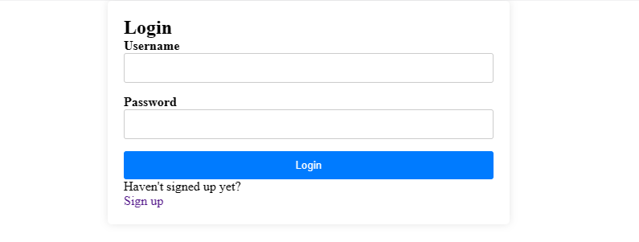
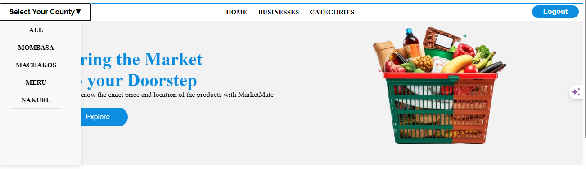
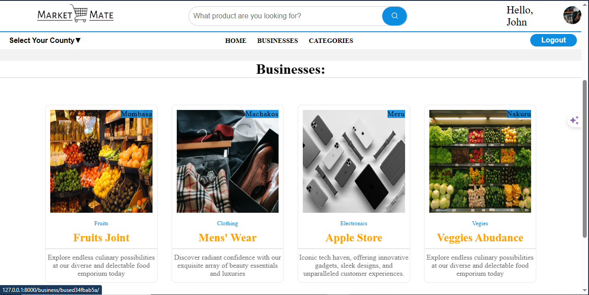
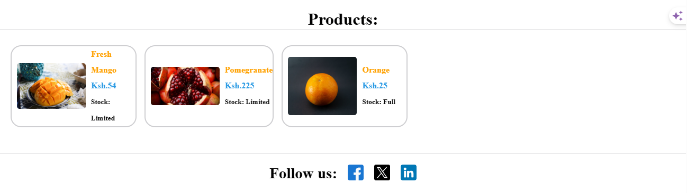

<header>
    <h1>MARKETMATE</h1>
  </header>
  <section id="introduction">
    <h2>Introduction</h2>
    
Marketmate is an application that will help traders to showcase their products and bring buyers who are fully packed with information.

  </section>
  <section id="team">
    <h2>The Team</h2>
    <ul>
      <li>Oscar Mutwiri - <a href="https://twitter.com/OscarM003">Twitter</a> / <a href="https://ke.linkedin.com/in/oscar-mutwiri-906099281">Linkedin</a> - Concentrated mostly on the frontend</li>
      <li>Kelvin Munene - <a href="https://twitter.com">Twitter</a> / <a href="https://linkedin.com">Linkedin</a> / <a href="https://github.com">Github</a> - Concentrated mostly on the backend</li>
    </ul>
  </section>
  <section id="inspiration">
    <h2>How this project was inspired</h2>
    
This project was inspired by our personal experiences and observations. At times some of us have encountered the challenge of locating specific products within a town, whether it be a new environment or our own familiar surroundings. It often involves traversing numerous corners of the town, only to find the desired item elusive or priced differently than anticipated.

    
Motivated by these encounters, we created MarketMate, a web application designed to facilitate the process. MarketMate empowers shops to showcase their products alongside their respective prices. Subsequently, users gain access to a comprehensive database, enabling them to swiftly locate desired items. This innovative solution aims to streamline the shopping experience, saving valuable time for all involved.

  </section>
  <section id="user-stories">
    <h2>Some User Stories Behind</h2>
    
As a very busy businessperson, I rarely get enough time to walk around the market and search for the products I want. Most of the time, I’m always calling different shops to check if they have what I need. Almost every time I find myself calling more than 7 shops just to confirm one product.

    
Because of this, I want to always browse through the website until I find the product I want and pin the location. This will guarantee a 1-call checkup, saving me a lot of time. Also, I will be able to pick up the product or anybody I send it to without wasting a lot of time.

    
I travel to new towns almost twice a month to make my business flourish. This has posed a challenge to me whenever I want to purchase something. Being in a new place becomes a problem when I want to buy something. I always end up moving up and down through the town or inquiring information from locals like a madman. Sometimes I don’t even find what I want in 1 day, but in 2 days.

    
I will be happy if I will be able to just sit down comfortably and locate the product I want. This will save me time. This will also give me enough room to instruct my Uber driver where I want to go instead of just walking by foot because I don’t know my destination.

  </section>
  <section id="technologies">
    <h2>TECHNOLOGIES</h2>
    <h3>Frontend:</h3>
    <ul>
      <li>HTML</li>
      <li>CSS</li>
      <li>JavaScript</li>
    </ul>
    <h3>Backend:</h3>
    <ul>
      <li>Python</li>
      <li>Django</li>
    </ul>
  </section>
  <section id="usage">
    <h2>Usage</h2>
    
Marketmate can be used to browse through the available products in your town or showcase your products. Stores have the chance to post their products accompanied by the prices regardless of the number of stores they own.

    <ol>
      <li>You need to create an account / Login
        
      </li>
      <li>Search for the product you need by category or filter all the businesses in your region / navigate to the businesses page and browse through.
        
        
      </li>
      <li>Click on the business to view products and other details such as price, address and phone number.
        
      </li>
    </ol>
  </section>